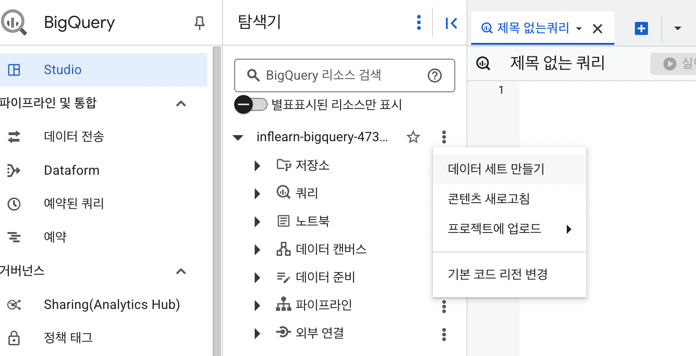

# note01. 빅쿼리 환경 세팅

## 1. BigQuery의 환경 구성 요소

### 1. 프로젝트(Project)
- 하나의 큰 건물. 건물 안에는 여러 목적을 가진 창고가 존재
회사에 따라 개수 다름 e.g. 프로젝트용, 개발용, ...
- 하나의 프로젝트에 여러 데이터셋이 존재할 수 있음

### 2. 데이터셋(Dataset)
- 프로젝트에 있는 창고. 각 창고 공간에 데이터를 저장
- 판매 데이터, 고객 데이터 등 별도의 데이터를 저장할 수 있음
- 하나의 데이터셋에 다양한 테이블이 존재할 수 있음

### 3.  테이블(Table)
- 창고에 있는 선반
- 테이블 안엔 상품의 세부 정보가 저작
- 테이블 안엔 행과 열로 이루어진 데이터들이 저장

### 3.1. 데이터세트 만들기

### 3.2. 테이블 생성
- 직접 업로드, S3 등 스토리지 이용 등 방법으로 테이블 생성  
생성한 데이터세트에 오른쪽 ... 누르면 테이블 만들기 있음
    - 스키마 자동 감지 체크
    - 스키마 자동 감지 체크를 안한다면 직접 텍스트로 편집
        ~~~
        id: INTEGER,
        date: DATE,
        timestamp: TIMESTAMP
        ~~~
    - 파티션 나누기  
        날짜와 같은 컬럼으로 파티션 설정
    - 고급설정  
        CSV 등 파일 업로드할 경우 "건너뛸 헤더 행" 수 설정 -> 컬럼명으로 사용된 행만큼 건너뛰기
### 4. 쿼리 실행
- 데이터셋 ... 누르면 "쿼리" 버튼 있음
- cmd + enter 또는 shift + enter로 쿼리 실행
- 쿼리는 일반 SQL 쿼라 짜듯 하면 됨