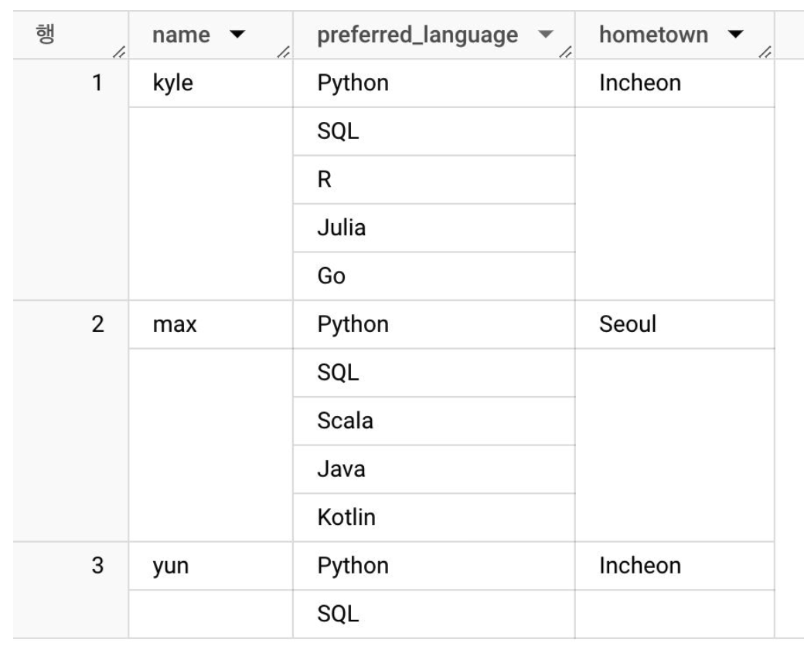
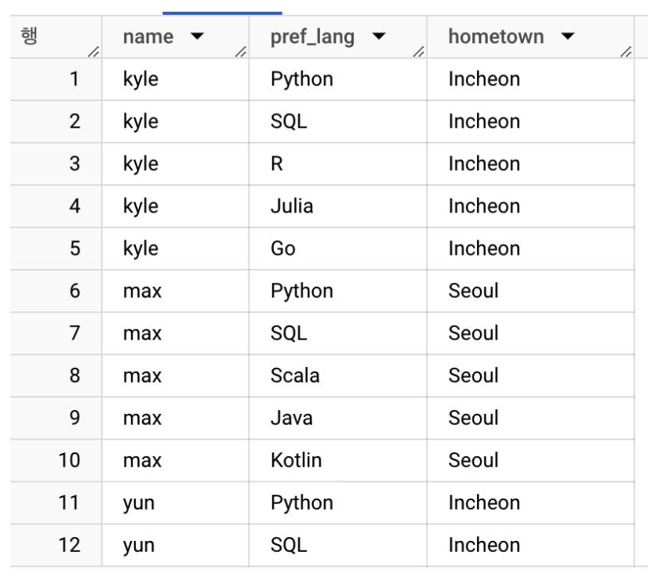
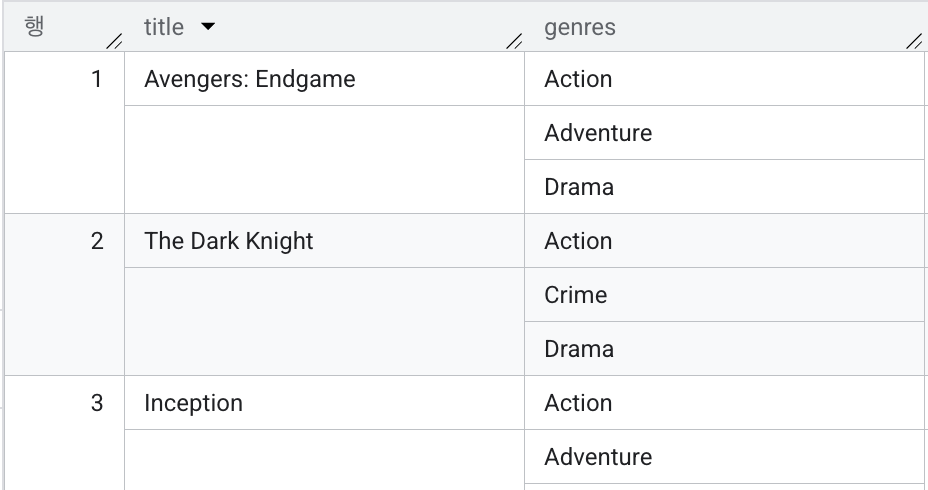
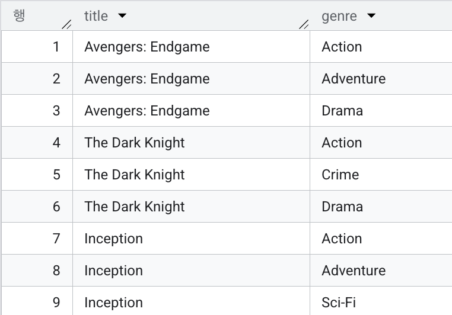
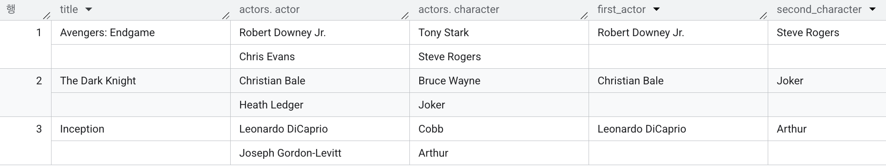
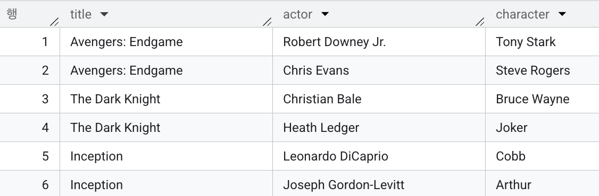
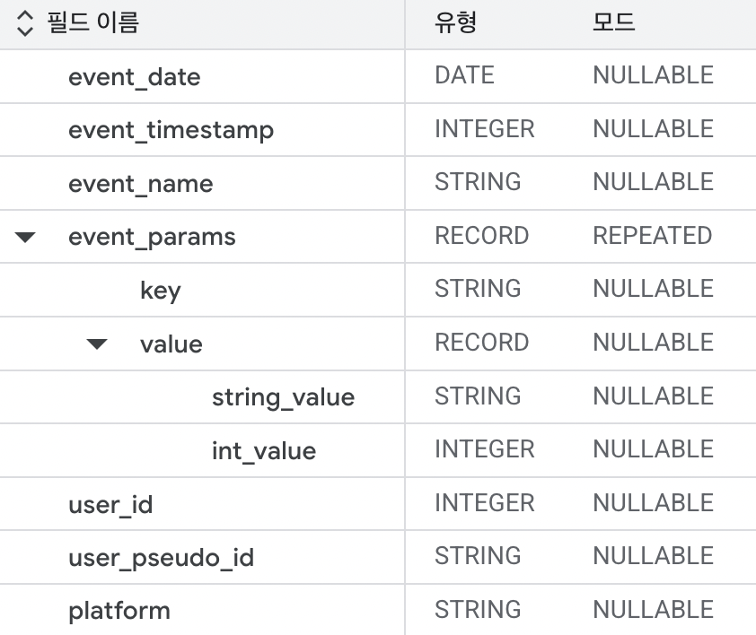
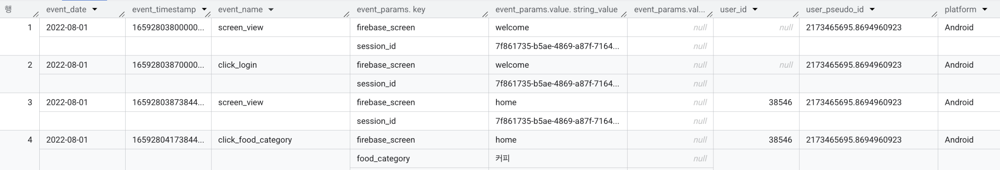
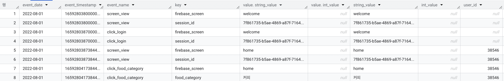

# note03. 빅쿼리에서의 쿼리

# ARRAY, STRUCT
- ARRAY와 STRUCT는 특히 BigQuery와 같은 최신 SQL 환경에서 중첩된 (Nested) 데이터를 다룰 때 유용하게 사용되는 데이터 타입

- unnest를 통해 nested 데이터 구조 flatten
    ~~~
    SELECT
    name, pref_lang, hometown
    FROM example_data
    CROSS JOIN UNNEST(preferred_language) AS pref_lang
    ~~~   

    

        

            
            
unnest 전 데이터 포맷

        

        

            
            
unnest 후 데이터 포맷

        

    

- 예제1. array로 묶여있는 genres 컬럼을 unnest로 flatten
    
    ~~~
    SELECT title,
        -- genres, # genre 컬럼 만드는 데 사용하고 가져오지 않아야 flatten 됨s
        genre
    FROM advanced.array_exercises as ae
    CROSS JOIN UNNEST(genres) as genre
    ~~~
    

- 예제2. array에 직접 접근 -> 매번 새로 SAFE_OFFSET 지정해야 함
    
    ~~~
    SELECT title,
            actors,
            actors[SAFE_OFFSET(0)].actor as first_actor, -- actors에 직접 접근하는 방법, actors 각 0번째 행 접근
            actors[SAFE_OFFSET(1)].character as second_character-- actors 각 1번째 행 접근
    FROM advanced.array_exercises as ae
    ~~~

- 예제3. array에 직접 접근이 아닌 unnest로 풀기
    
    ~~~
    SELECT title,
            actor.actor,
            actor.character
    FROM advanced.array_exercises as ae
    CROSS JOIN UNNEST(actors) as actor
    ~~~

- 참고. array 컬럼 두 개일 때 cross join unnest 두 번, 데이터 중복 발생할 수 있음
    ~~~
    SELECT title,
            actor.actor,
            actor.character,
            genre
    FROM advanced.array_exercises as ae
    CROSS JOIN UNNEST(actors) as actor
    CROSS JOIN UNNEST(genres) as genre
    ~~~

    - CROSS JOIN 부분 생략하고 콤마 + UNNEST로 써도 됨, ARRAY 데이터 WHERE절 쓸 때 상위컬럼명.하위컬럼명으로 필터링
        ~~~
        SELECT title,
                actor.actor,
                actor.character,
                genre
        FROM advanced.array_exercises as ae, UNNEST(actors) as actor, UNNEST(genres) as genre
        WHERE actor.actor = "Chris Evans" AND genre = "action"
        ~~~

- 모든 앱로그 데이터 ARRAY flatten
    - 스키마 참고
        
    - flatten 전 보통의 앱로그 데이터 포맷
        
    - flatten 전 보통의 앱로그 데이터 포맷
        
        ~~~
        SELECT event_date,
                event_timestamp,
                event_name,
                event_param.key as key,
                event_param.value AS value,
                -- event_params 하위 > value 하위 값 가져오기
                event_param.value.string_value AS string_value,
                event_param.value.int_value AS int_value,
                --  event_params,
                user_id
        FROM  advanced.app_logs
        CROSS JOIN UNNEST(event_params) AS event_param
        WHERE event_date = "2022-08-01"
        ~~~